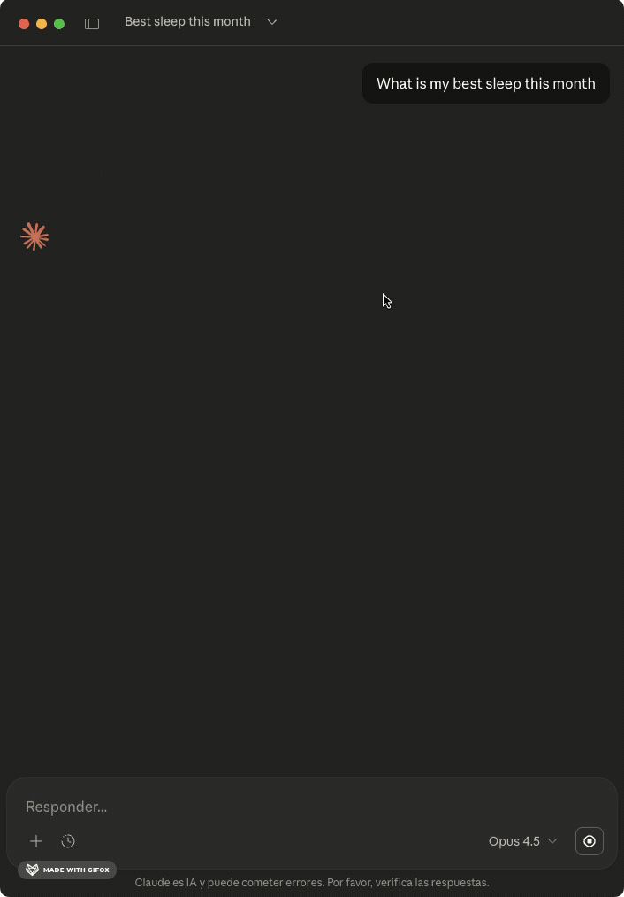

# Oura MCP Server

[](https://www.npmjs.com/package/oura-ring-mcp)
[](https://registry.modelcontextprotocol.io)
[](https://github.com/mitchhankins01/oura-ring-mcp/actions/workflows/ci.yml)

An MCP server that connects your Oura Ring to Claude and other AI assistants. Get human-readable insights about your sleep, readiness, and activity—not just raw JSON.

## Features



- **Smart formatting** - Durations in hours/minutes, scores with context ("85 - Optimal")
- **Sleep analysis** - Sleep stages, efficiency, HRV, and biometrics
- **Readiness tracking** - Recovery scores and contributor breakdown
- **Activity data** - Steps, calories, and intensity breakdown
- **Health metrics** - Heart rate, SpO2, stress, cardiovascular age
- **Smart analysis** - Anomaly detection, correlations, trend analysis
- **Tags support** - Compare metrics with/without conditions

[See example outputs](docs/outputs/EXAMPLES.md) — what Claude returns for sleep, readiness, weekly summaries, and smart analysis

## Quick Start

### 1. Install

```bash
npm install -g oura-ring-mcp
```

Or use directly with npx (no install needed):
```bash
npx oura-ring-mcp
```

### 2. Authenticate with Oura

**Option A: Personal Access Token (simpler)**

1. Go to [cloud.ouraring.com/personal-access-tokens](https://cloud.ouraring.com/personal-access-tokens)
2. Create a new token
3. Set `OURA_ACCESS_TOKEN` in your Claude Desktop config (see below)

**Option B: OAuth CLI Flow**

1. Create an OAuth app at [developer.ouraring.com](https://developer.ouraring.com/applications)
   - Set Redirect URI to `http://localhost:3000/callback`
2. Run the auth flow:
   ```bash
   export OURA_CLIENT_ID=your_client_id
   export OURA_CLIENT_SECRET=your_client_secret
   npx oura-ring-mcp auth
   ```
3. Credentials are saved to `~/.oura-mcp/credentials.json`

### 3. Configure Claude Desktop

Add to `claude_desktop_config.json`:

**With Personal Access Token:**
```json
{
  "mcpServers": {
    "oura": {
      "command": "npx",
      "args": ["oura-ring-mcp"],
      "env": {
        "OURA_ACCESS_TOKEN": "your_token_here"
      }
    }
  }
}
```

**With OAuth (after running `npx oura-ring-mcp auth`):**
```json
{
  "mcpServers": {
    "oura": {
      "command": "npx",
      "args": ["oura-ring-mcp"]
    }
  }
}
```

The server reads credentials from `~/.oura-mcp/credentials.json`. To enable automatic token refresh, add your OAuth credentials:

```json
{
  "mcpServers": {
    "oura": {
      "command": "npx",
      "args": ["oura-ring-mcp"],
      "env": {
        "OURA_CLIENT_ID": "your_client_id",
        "OURA_CLIENT_SECRET": "your_client_secret"
      }
    }
  }
}
```

Restart Claude Desktop. Requires Node >=18.

## What Can I Ask?

**Daily check-ins:**
- "How did I sleep last night?"
- "Am I recovered enough to work out today?"
- "What's my body telling me right now?"

**Patterns & trends:**
- "Do I sleep better on weekends?"
- "What time should I go to bed for optimal sleep?"
- "Is my HRV improving or declining?"

**Correlations & insights:**
- "Does alcohol affect my sleep quality?"
- "What predicts my best sleep nights?"
- "How does exercise timing affect my recovery?"

**Comparisons:**
- "Compare my sleep this week vs last week"
- "How do I sleep after meditation vs without?"
- "What changed when I started taking magnesium?"

**Anomalies:**
- "Are there any unusual readings in my data?"
- "Why was my readiness so low yesterday?"
- "Find days where my metrics were off"

## Available Tools

### Data Retrieval

| Tool | Description |
|------|-------------|
| `get_sleep` | Sleep data with stages, efficiency, HR, HRV |
| `get_daily_sleep` | Daily sleep scores with contributors |
| `get_readiness` | Readiness scores and recovery metrics |
| `get_activity` | Steps, calories, intensity breakdown |
| `get_workouts` | Workout sessions with type and intensity |
| `get_sessions` | Meditation and relaxation sessions |
| `get_heart_rate` | HR readings throughout the day |
| `get_stress` | Stress levels and recovery time |
| `get_spo2` | Blood oxygen and breathing disturbance |
| `get_tags` | User-created tags and notes |

### Smart Analysis

| Tool | Description |
|------|-------------|
| `detect_anomalies` | Find unusual readings using outlier detection |
| `analyze_sleep_quality` | Sleep analysis with trends, patterns, debt |
| `correlate_metrics` | Find correlations between health metrics |
| `compare_periods` | Compare this week vs last week |
| `compare_conditions` | Compare metrics with/without a tag |
| `best_sleep_conditions` | What predicts your good vs poor sleep |
| `analyze_hrv_trend` | HRV trend with rolling averages |

## Resources

| Resource | Description |
|----------|-------------|
| `oura://today` | Today's health summary |
| `oura://weekly-summary` | Last 7 days with averages |
| `oura://baseline` | Your 30-day averages and normal ranges |
| `oura://monthly-insights` | 30-day analysis with trends and anomalies |
| `oura://tag-summary` | Your tags and usage frequency |

## Prompts

| Prompt | Description |
|--------|-------------|
| `weekly-review` | Comprehensive weekly health review |
| `sleep-optimization` | Identify what leads to your best sleep |
| `recovery-check` | Should you train hard or rest today? |
| `compare-weeks` | This week vs last week comparison |
| `tag-analysis` | How a specific tag affects your health |

## Contributing

See [CLAUDE.md](CLAUDE.md) for architecture details and development guidelines.

## License

MIT
